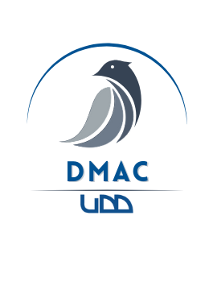

    
    

    <h1>Bienvenidos al repositorio del "Data Market Analysis Club" de la universidad Del Desarrollo - DMAC UDD</h1>

----------

    <h2> ¿Qué es DMAC?</h2>

Data Market Analysis Club UDD (DMAC) (De ahora en adelante “DMAC” o el Club), constituye una organización estudiantil sin fines de lucro, con base en la Universidad del Desarrollo. Su foco es el desarrollo de competencias en análisis cuantitativo y finanzas de mercado.

### Misión:

Fomentar la excelencia en finanzas de mercado y análisis cuantitativo dentro de la Universidad del Desarrollo, brindando a sus miembros espacios de formación continua, proyectos aplicados y vínculos con el sector financiero.

### Visión:
Posicionarnos como referente nacional en educación financiera basada en datos, reconocidos por la rigurosidad de nuestros análisis, la innovación de nuestras metodologías y el impacto de nuestras alianzas.

### Valores:  
* __Probidad__: Integridad y ética irreprochable en cada análisis, colaboración y de los integrantes.
* __Excelencia__: Búsqueda constante de calidad académica y técnica. 
* __Profesionalismo__: Compromiso con mejores prácticas y estándares del sector. 
* __Transparencia__: Comunicación clara y apertura en métodos, resultados y gobernanza.
----------

    <h2> ¿Por qué un GitHub?</h2>

El objetivo de este repositorio es documentar cada uno de los talleres hechos respecto al análisis financiero tecnológico (FinTech), principalmente usando python, y librerías como __PyFinance__, __Pandas__, __MatplotLib__, __seaborn__, y librerías de análisis y ciencias de datos como __scikit-learn__, __tensorflow__ y/o __PyTorch__.
